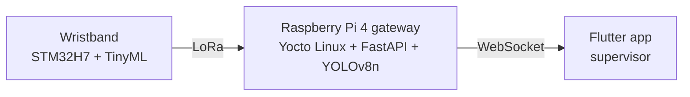

# Hi, I'm Mohamed Aziz Hadjayed 👋

**Edge AI engineer** — I build intelligent systems end to end: sensors and microcontrollers, the AI model that runs on them,
and the gateway and mobile app that use its results.

- 🎓 Engineering degree in Infotronics Systems Engineering (Edge AI specialization), **ENICarthage**, Tunisia — 2026
- 🇸🇪 Final-year project carried out remotely for **Luleå University of Technology**, Sweden
- 📍 Ariana, Tunisia — **open to Edge AI / ML engineer roles**

---

## 🔬 Featured project — Edge AI fatigue detection for industrial workers

A complete system, from the wrist to the supervisor's phone:

| Repository | What it shows |
|---|---|
| [**edge.ai-wearable-fatigue-detection**](https://github.com/aziz-hadjayed/edge.ai-wearable-fatigue-detection) | 13-model benchmark, knowledge distillation, INT8 CNN on STM32H7 — **48.5 KB Flash, 14 ms, 2.94 mJ** per inference, 95.2 % fatigue recall |
| [**yocto-fatigue-monitoring**](https://github.com/aziz-hadjayed/yocto-fatigue-monitoring) | Custom Yocto layer: reproducible, hardened Linux image for the Raspberry Pi 4 gateway |
| [**FATIGUE_MONITORING_MOBILE_APP**](https://github.com/aziz-hadjayed/FATIGUE_MONITORING_MOBILE_APP) | FastAPI server with defense-in-depth security + Flutter real-time supervision app |

---

## 🛠️ Tech stack

**Edge AI / TinyML** — X-CUBE-AI · TensorFlow Lite · ONNX · INT8 quantization · pruning · knowledge distillation
**Machine learning** — TensorFlow / Keras · scikit-learn · LightGBM · XGBoost · Optuna · YOLOv8
**Embedded** — STM32 (H7, F4) · ESP32 · Raspberry Pi · FreeRTOS · Yocto · embedded Linux
**IoT & backend** — LoRa · MQTT · FastAPI · WebSocket · Flutter
**Languages** — C · C++ · Python · Dart

---

## 📫 Contact

[LinkedIn](https://www.linkedin.com/in/mohamedaziz-hadjayed/) · hadjayedaziz2@gmail.com
